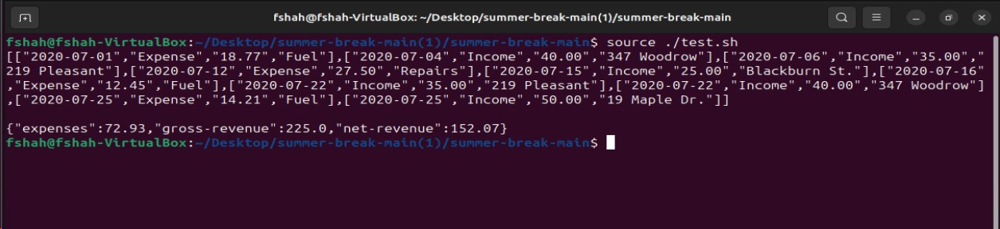

# summer-break
<h2>Environment Setup, Running and Testing the Code</h2>
<p>To test this code you need bash setup and working. 
Currently I have tested the code in Ubuntu 23.04 version.
</p>
<br/>
<h4>Steps to install Python and Flask</h4>
<ul>
<li>To install Python type in the following commands in your terminal:</li>

``` 
sudo apt update
```
```
sudo apt install python3
```

<li>To install Flask, type in the following commands in your terminal:</li>

```commandline
sudo apt install python3-venv
```
<p>Navigate inside the current folder and then type these commands: </p>

```commandline
python3 -m venv venv 
```

```
source venv/bin/activate
```

```
pip install Flask
```
</ul>
<br/>

<h4>Steps to run and test the code:</h4>
<ul>
<li>Make sure the data.csv file, test.sh file and the solution.py file all in same folder.</li>
<li>Navigate to the directory containing these files and open the terminal there.</li>
<li>Start the Flask app by running the following command in terminal:

```commandline
source venv/bin/activate
```

```commandline
python3 solution.py
```
<p>The Flask development server has now started and is successfully running on 'http://127.0.0.1:5000' by default.</p>
</li>
<li>Now to test the endpoints open another terminal within this folder and type in the following command:

```commandline
source ./test.sh
```

this will execute the test.sh file which has the commands to test the endpoints "/transactions" and "/report".

An output like this will be produced on your terminal.
<br/>



</li>
</ul>


<h3>Current Approach to the Solution and any Assumptions made</h3>

<p>Current solution has 2 API endpoints setup: 
  <ul>
    <li>the '/transactions' endpoint, takes in the .csv file as input as parses it's data and stores it.
      <ul>
    <li>The logic behind parsing the CSV file is that is only takes into consideration those lines from the file which has 4 fields available `Date, Type, Amount($), Memo`. Rest all lines will be ignored.</li>
    <li>The Parsed data from the CSV is stored in a Nested List form.</li>
        </ul>
    </li>
    <li>the '/report' endpoint, gives the user a tally report of gross revenue, total expenses and net revenue (gross revenue - total expenses) in a JSON format. 
      <ul>
    <li>The logic behind this is that whenever this endpoint is called we take the csv parsed data which is stored in a nested list, we iterate through the data and perform calculations for gross revenue, total expenses and net revenue.</li>
              </ul>
    </li>
  </ul>
</p>

<br/>
<p>Assumption is made that in the .csv file being uploaded, if a row contains 4 fields they are all valid fields.</p>

